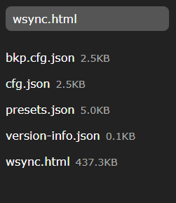

# WLED integration

WSync LED can easily be self-hosted on a WLED device, thereby enabling access without an internet connection.

## Self-host WSync-LED over WLED

1. Access the edit page of your WLED device at `http://<WLED-IP>/edit`.
2. Click on `Upload File`, then pick the builded file `dist/wsync.html`. 
3. Allow the transfer to complete, you will see a file named `wsync.html` in the left pane of the page. 
4. Access `http://<WLED-IP>/wsync.html` via a browser on the same network, and you will see WSync-LED!

> [!NOTE]
> As you can see, the `wsync.html` file is self-contained but very large, especially for a WLED device with limited resources.

## Discovering WLED devices over network

> [!WARNING]
> This section covers features available only since `v2.0.0`.

WSync-LED can scan your network to find any WLED device.
It will send a request to `http://<DEVICE-IP>/json/info` to the following IP adresses in this order:

- Current configuration IP
- `192.168.4.1` (AP mode)
- Current server IP
- IP from `192.168.1.1` to `192.168.1.255`

> [!CAUTION]
> This requests interacts directly with your devices on the current network, making up to 257 requests!
> Communication takes place via an insecure connection (HTTP).

> The scan stops at the first device meeting the following conditions :
> - The device can handle the request (CORS)
> - The device respond in less than 50ms
> - The endpoint `/json/info` is available
> - It returns a valid JSON
> - The `brand` value is set to `WLED`