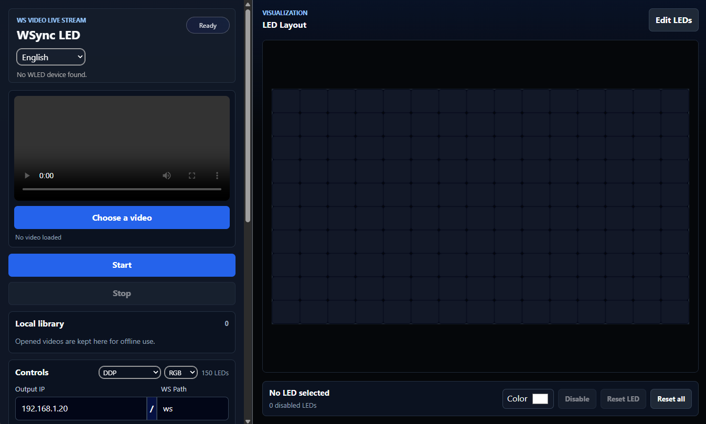
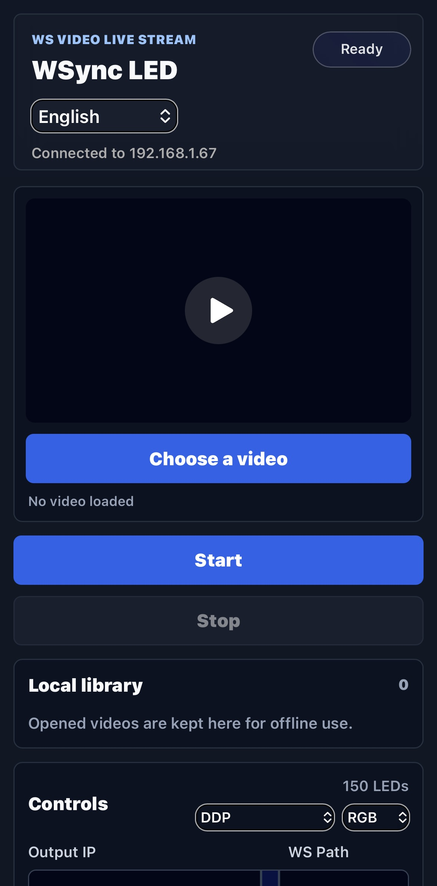
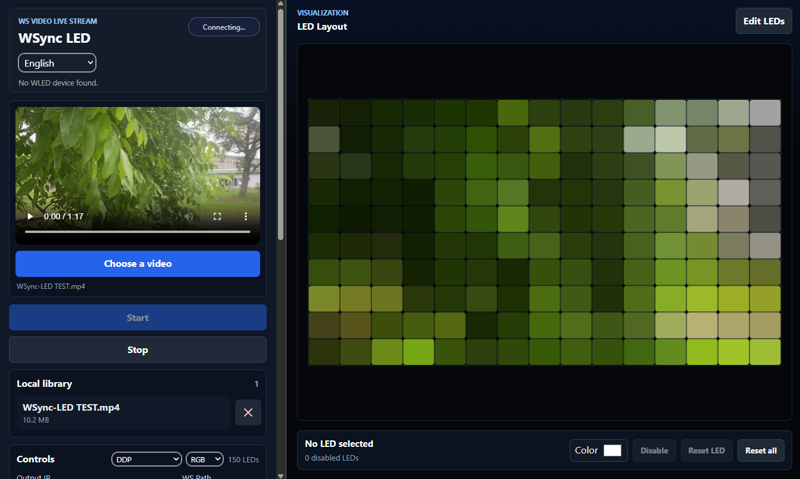

# Architecture

WSync-LED is a React and TypeScript application built with Vite. It separates the user interface, persistent settings, video handling, LED frame generation, and WebSocket transport into focused modules.

> [!WARNING]
> This section covers features available only since `v2.0.0`.

## High Level Flow

1. The user selects or reopens a local video.
2. The renderer draws the current video frame to a hidden canvas.
3. The LED layout module creates sampling positions for the active layout.
4. The frame builder averages colors for each LED sample area.
5. Color processing applies threshold, gamma, gain, saturation, RGBW conversion, and smoothing.
6. Protocol builders serialize the frame as DDP or JSON packets.
7. The WebSocket hook sends the packets to the configured controller.
8. The preview updates with the latest computed LED colors.

## Application Shell

The main application component coordinates the feature hooks and renders two primary areas:

- Controls for video loading, connection status, output settings, and library management.
- Preview for the video LED layout and individual LED overrides.

On desktop, the controls and preview are shown in resizable panels. On smaller screens, the interface is arranged vertically for mobile use.

<div style="display:flex;gap:15px;width:100%">
    <figure style="text-align:center">
        
        <figcaption><b>Desktop view</b></figcaption>
    </figure>
    <figure style="text-align:center">
    
    <figcaption><b>Mobile view</b></figcaption>
    </figure>
</div>

## State and Persistence

Application settings are stored under `wsync-led-settings-v1`. Per-LED overrides are stored under `wsync-led-overrides-v1`.

Video metadata and blobs are stored in IndexedDB through the video cache module. This keeps opened videos available locally without uploading files to a server.

## Video Processing

The renderer uses the browser video and canvas APIs:

- The video element provides the current playback frame.
- A canvas receives a scaled copy of that frame.
- `getImageData` exposes pixels for sampling.
- The render loop is throttled by the configured FPS.

The analysis canvas size is bounded to keep processing predictable while still preserving enough spatial detail for LED sampling.

## LED Layouts

WSync-LED supports three mapping modes:

| Mode      | Use case                                      |
| --------- | --------------------------------------------- |
| Grid      | Rectangular matrix installations.             |
| Perimeter | Four-sided ambient lighting around a display. |
| Border    | Three-sided layouts without a bottom edge.    |

Each layout produces ordered LED positions with an output index. The output index can be reversed when the physical LED strip direction requires it.


<figure style="text-align:center">
    <center>
        
    </center>
    <figcaption><strong>Grid mode preview</strong></figcaption>
</figure>

## Frame Building

For every LED position, the frame builder samples a rectangular region of the current image and computes an average color. It then applies:

- Per LED disable or fixed color overrides.
- Smoothing against the previous frame.
- Brightness thresholding.
- Gamma and gain correction.
- Saturation adjustment.
- Optional RGB to RGBW conversion.

The result is both a preview color array and a byte buffer ready for protocol encoding.

## WebSocket Transport

The WebSocket hook owns connection lifecycle and packet sending. It opens:

```text
ws://<output-ip>/<ws-path>
```
> [!CAUTION]
> WebSocket connection between devices is unsecure and unencrypted, make sure to be on a private network.

When the device sends WLED metadata, the app can use it to update settings such as LED count, FPS, and RGBW support while preserving user changed values.

## Protocol Layer

Protocol serialization is isolated in `src/lib/protocols`.

| Protocol | Status             | Notes                                         |
| -------- | ------------------ | --------------------------------------------- |
| DDP      | Recommended        | Efficient binary format for WLED streaming.   |
| JSON     | Compatibility mode | Less efficient and marked unstable in the UI. |

This boundary makes it possible to add more WebSocket compatible protocols without changing the renderer.

## Internationalization

The UI uses English and French translation files in `src/lang/`. Translation key consistency is checked with:

```bash
npm run check:i18n
```

## Generated API Documentation

The API reference is generated by TypeDoc into `docs/api`. Those files document exported components, hooks, types, configuration values, and library helpers.
