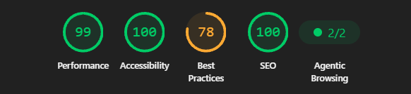

# Accessibility

WSync-LED has been designed to be as accessible as possible.

During development, please keep in mind these major principles:

- Simplicity over complexity.
- Every feature should remain easy to discover and understand.
- Keyboard navigation must be supported.
- Provide clear feedback for every user action.
- Ensure sufficient contrast and readable typography.
- Accessibility is not optional !

## Lighthouse Audit Results

Our Lighthouse accessibility audit score:

> [!IMPORTANT]
> This Lighthouse audit was performed on a local server, therefore, the `Performance` metrics might be less representative of a real world use case.